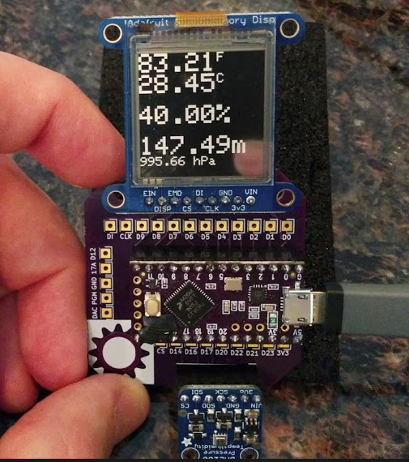

## OSH Park shared project
* [SHARP memory display and Teensy LC](https://oshpark.com/projects/4Hbq9Awy)

## Bill of Materials
* [SHARP Memory Display Breakout - 1.3" 96x96 Silver Monochrome](https://www.adafruit.com/product/1393)
* [Teensy LC - OSH Park Edition](http://store.oshpark.com/products/teensy-lc)
* [Adafruit BME280 sensor *(Temp/Hum/Press)*](https://www.adafruit.com/product/2652)

## Video
* [Short demo](https://www.youtube.com/watch?v=esPlImZcRdI)
* [Full demo](https://www.youtube.com/watch?v=OchR3nb700U)

## Photos
* [Google+ gallery](https://plus.google.com/photos/+DrewFustini/albums/6319926590582577217)
* [images gallery](https://github.com/pdp7/memory-display/tree/master/images)
* 

## License
This project released under the CERN Open Hardware v1.2 License

**Note:** `memory-display.ino` based on library code and example code from [Adafruit Industries](http://adafruit.com/)

## Contact
* Drew Fustini &lt;drew@oshpark.com&gt;
